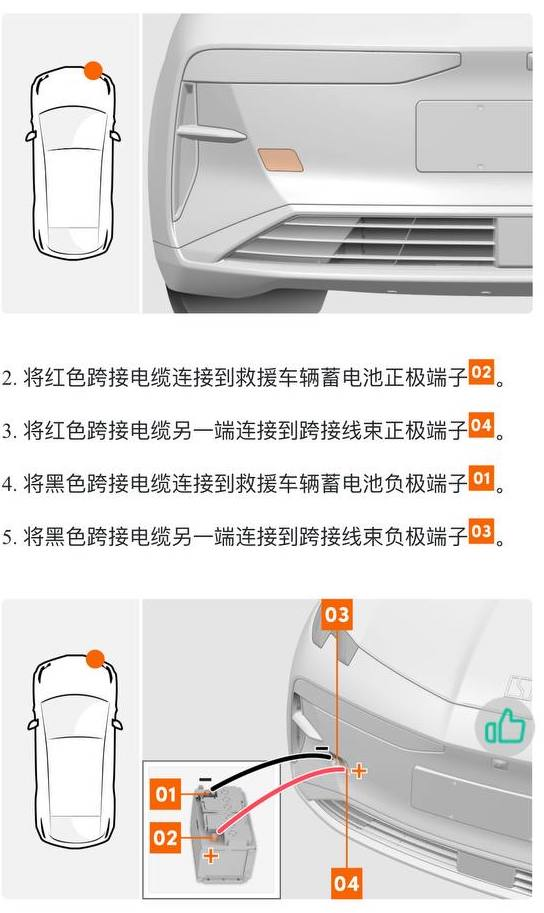

## Что если не нашел ответа здесь?

* прочтите [Введение](README.md), есть вероятность, что это базовая информация
* предложите вопрос для FAQ раздела в [ZEEKR Club в
  Telegram](https://t.me/zeekrclub/158198)

## КАК ПЕРЕКЛЮЧИТЬ ЯЗЫК НА АНГЛИЙСКИЙ ИЛИ РУССКИЙ? КАК ПОМЕНЯТЬ ВРЕМЯ?

**НИКАК!**
!!! Danger
    Серьезно. Самостоятельно вы этого не сможете сделать! Но есть ньюансы - **TODO**.

## Как установить мобильное приложение Zeekr?

1. скачать [приложение Zeekr](https://www.zeekrlife.com/download)
1. зарегистрироваться в нем на свой китайский номер (+86xxxxxxxxxxx). Если у
   вас такого нет, вам сюда: [WeChat + eSender: покупка китайского виртуального
   номера](wechat_n_esender.md)

## Как получить китайский номер? eSender

[WeChat + eSender: покупка китайского виртуального номера](wechat_n_esender.md)

## Как получить MA / FA?

[Введение / Аккаунт (MA / FA)](README.md#akkaunt-ma-fa-)

## Как активировать машину?

[Активация машины / RNR / real name registration](activate_car.md)

## Как перезагрузить планшет?

**001**:

* нажимаете на регулятор громкости (*шайбу*) и держите 10с
* далее, не отпуская его, вращаете по часовой стрелке пока не пропадет картинка
  на экране

**009**

* зажимаете на руле кнопки: "Mute"

**X**:

* зажимайте на руле две кнопки (*левую на левой части и правую на правой: не
  джойстики*)

    ??? info "фото"
        { loading=lazy }

## Как перезагрузить блок телематики?

!!! info
    Блок телематики -- это блок, в котором установлена сим-карта.

Зажимаем кнопку SOS на 15-20 секунд.

## Можно ли буксировать?

**Нет.** Синхронный двигатель на постоянных магнитах невозможно отключить, поэтому
при буксировке он будет неустанно генерировать электроэнергию и сожжет дорогой
вашему сердцу автомобиль.

[Видео с пояснениями для разных типов двигателей](https://www.youtube.com/watch?v=xBl7bkkD-lM)

!!! Danger
    Есть рассуждения, что пока автомобиль включен и работает в режиме
    рекуперации, то буксировать можно, но только на минимальной или средней
    рекуперации. Но можете ли вы гарантировать, что вашему буксируемому авто не
    станет хуже, рекуперация не отключится и он не сгорит синим пламенем (в
    идеале без вас внутри)?

## Можно ли прикуривать?

Прикуривать нельзя.

Нужно открыть капот, отключить 12В АКБ и зарядить его. Как открыть капот, если
разрядился 12В АКБ, [смотреть тут](FAQ.md#razryadilas-i-ne-otkryvaetsya-kak-otkryt-kapot-).

## Разрядилась и не открывается / как открыть капот?

!!! Warning
    Нельзя прикуривать от аккумуляторов заведенных авто, можно только подключать
    12В аккумулятор донор.

**Zeekr 001, 009**

Зарядить 12В АКБ после того как откроете капот одним из следующих способов:

* открыть машину железным ключом и открыть капот (**только для 001**)
* в арке **строго над** передним колесом (*на 12 часов, не справа на 14, а над ↑*) со стороны водителя есть резиновая заглушка-лючок.
  Тросик дернуть два раза, капот откроется -- [видео](https://t.me/zeekrclub/129579/131259)

**Zeekr X**

Смотрим на нос машины, в левой части бампера есть лючок, красный провод к плюсу
12V аккумулятора донора, второй провод на минус. Машина откроется, откроете
капот и зарядите 12V АКБ.

??? info "схема"

    { loading=lazy }

## Не открывается Bluetooth ключом

**001 и 009**

Приложите Bluetooth ключ к стойке водительской двери (*туда же, куда
прикладывается ключ-карта*). Если машина реагирует (*открывается /
закрывается*), значит дело в батарейке в ключе. По замене батарейки [смотреть
тут](FAQ.md#kak-otkryt-bluetooth-klyuch-zamenit-batareyku).

**X**

По сообщениям, прикладывание Bluetooth ключа к стойке водительской двери Иксы
не открывает, поэтому единственным способом исключить проблему с разряженной
батарейкой в ключе является замена батарейки. По замене батарейки [смотреть
тут](FAQ.md#kak-otkryt-bluetooth-klyuch-zamenit-batareyku).

## Как открыть Bluetooth ключ / заменить батарейку

**001 и 009**

* вставляем в отверстие скрепку, которая идет в комплекте с ключом, и
  раздвигаем половинки ключа

    ??? info "фото"
        { loading=lazy }

        { loading=lazy }
        { loading=lazy }

* заменить батарейку CR3032 (*в идеале, Panasonic*)

**X**

* открыть ключ поворотом крышки **по часовой стрелке**

* заменить батарейку CR2450 (*в идеале, Panasonic*)

* при сборке ориентируйтесь на стрелки на крышке и корпусе ключа

    ??? info "схема"
        { loading=lazy }

        { loading=lazy }

## Как открыть 001 металлическим ключом?

* зажмите ручку водительской двери
* выньте заднюю часть, потяните на себя и выньте всю ручку
* под ручкой найдите гнездо для ключа, вставьте ключ и поверните против часовой
  стрелки

## На планшете вверху красная надпись 交付中心模式中 (delivery mode), из которого не получатеся "выйти".
У вас не пройдена предпродажная подготовка. Самостоятельно убрать эту надпись не получится - только через специалистов за деньги. Задайте вопрос своему поставщику - продавать авто без предпродажной подготовки крайне не профиссионально, старайтесь избегать таких поставщиков.

??? info "delivery mode"

    { loading=lazy }

## Высокое потребление низковольтной сети

!!! info
    *Также в некоторых переводах звучит как: "низкое давление" и "низкое напряжение".*

Владельцы 001 неоднократно сталкивались с проблемами, связанными с подкачкой
передних сидений. Ресивер (пластиковый баллон) в сидениях и/или трубки травят.

Симптомы:

* высокий расход энергии на низковольтных (12В) потребителей в условиях, когда
  вы часами не смотрите ютюбы, слушаете музыку и мучаете климат.

    ??? info "фото"
        { loading=lazy }

* насосы в сидениях либо слишком часто включаются, либо не выключаются вовсе
  (*гудение можно услышать в тихом месте, включив Drive*).

Для деталей о том как это лечить лучше прочесть [пару десятков сообщений,
начиная с этого](https://t.me/zeekrclub/129579/133695).

## Где посмотреть номера двигателей?

Номера двигателей дублируются наклейками под капотом и на крышке багажника.

## Где найти VIN?

Под правым передним сидением (отодвиньте его максимально назад).

## Как обесточить машину? (через "петлю")

1. Снять минусовую клемму аккумулятора
1. Отсоединить петлю
1. Подождать 10 минут, капот не закрывать, потом в обратном порядке: соединить петлю, подключить минусовую клемму аккумулятора.

[Видео для 001](https://t.me/zeekrclub/129577/169842)

## Как аварийно открыть порт зарядки?

**001:** автомобиль нельзя нельзя заряжать, если разряжен 12В АКБ. Поэтому
придется открыть капот ([см.
сюда](FAQ.md#razryadilas-i-ne-otkryvaetsya-kak-otkryt-kapot-)) и сначала
зарядить 12В АКБ.

**009:**

Порт медленной зарядки:

* в арке переднего левого колеса сверху справа (*на два часа*) поверните
  заглушку
* потяните за тросик

    ??? info "схема"
        { loading=lazy }

Порт быстрой зарядки:

* в багажнике на левой стенке под крючком откройте крышку
* потяните за тросик

    ??? info "схема"

        { loading=lazy }

        { loading=lazy }

**X:**

* в арке левого заднего колеса сверху слева (*на пол-одиннадцатого*)
  откручиваем заглушку
* одновременно тянем тросик и аккуратно тянем за крышку зарядного порта вниз

??? info "схема"
    { loading=lazy }

## Как аварийно разбокировать зарядный пистолет - AC?

*AC - медленная зарядка.*

**001 и 009**

* в арке переднего левого колеса сверху справа (*на два часа*) поверните
  заглушку
* потяните за тросик
* вытащите зарядный пистолет
* установите на место заглушку

??? info "схема для 001"
    { loading=lazy }

**X:**

* в багажнике открыть подпол
* слева у стенки будет лючок, под ним тросик

??? info "схема"
    { loading=lazy }

## Как аварийно разблокировать зарядный пистолет - DC?

*DC - быстрая зарядка.*

**После того как вы убедились, что зарядка со стороны зарядной станции
полностью остановлена**: под ручкой пистолета есть шток, который нужно поднять
отверткой и далее пистолет можно вытащить. [Смотрите
видео](https://t.me/zeekrclub/94830)

## Как включить нейтраль, чтобы погрузиться на эвакуатор?

1. Убедитесь, что БТ ключ находится в машине, либо можно приложить карту к считывателю NFC (где зарядка для телефона)
1. Откройте дверь водителя и снова закройте
1. Нажмите и держите кнопку включения аварийки 7 секунд
1. Переключитесь на N, для снятия стояночного тормоза

??? info "Режим буксировки"

    { loading=lazy }

После погрузки:

1. Включите паркинг (P)
1. Заприте автомобиль снаружи.

## Места для домкрата / подъемника

**TODO: for 001**

**TODO: for 009**

**X:**

??? info "схема"
    { loading=lazy }

## Проблемы с камерами кругового обзора 360

Попробуйте извлечь предохранитель и вернуть его на место через 5 секунд. Блок предохранителей находится слева за обшивкой на месте пасажира. 

??? info "Сброс камер 360"

    { loading=lazy }

[Видео для 001](https://t.me/zeekrclub_tech/34528)

## Не работает пневма, не переключается на другие режимы кроме LOW (горит ошибка на экране водителя в виде красной иконки)

Попробуйте поднять опустить пневму с помощью кнопок в багажнике.

## Штатная зарядка Zeekr

[Подключение + машинный перевод инструкции](README.md#podklyuchenie-shtatnoy-zaryadki)
