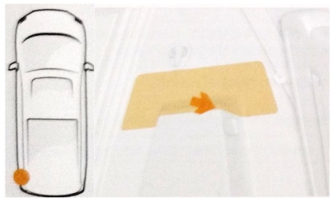
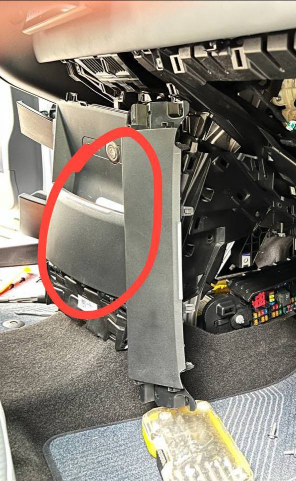

## Что если не нашел ответа здесь?

* прочтите [Введение](README.md), есть вероятность, что это базовая информация
* предложите вопрос для FAQ раздела в [ZEEKR Club в
  Telegram](https://t.me/zeekrclub/158198)


## <span style="color:red">КАК ПЕРЕКЛЮЧИТЬ ЯЗЫК НА АНГЛИЙСКИЙ ИЛИ РУССКИЙ? КАК ПОМЕНЯТЬ ВРЕМЯ?</span>

**НИКАК!**
!!! Danger
    Серьезно. Самостоятельно вы этого не сможете сделать! Но есть ньюансы - **TODO**.

## Как установить мобильное приложение Zeekr?

1. скачать [приложение Zeekr](https://zeekrlife-h5.zeekrlife.com/pages/download/index)
1. зарегистрироваться в нем на свой китайский номер (+86xxxxxxxxxxx). Если у
   вас такого нет, вам сюда: [WeChat + eSender: покупка китайского виртуального
   номера](wechat_n_esender.md)

## Как получить китайский номер? eSender

[WeChat + eSender: покупка китайского виртуального номера](wechat_n_esender.md)


## Как получить MA / FA?

[Введение / Аккаунт (MA / FA)](README.md#akkaunt-ma-fa-)


## Как отличить MA / FA?

Если машина появилась в приложении Zeekr сама без принятия приглашения, значит
у вас MA (master account / мастер-аккаунт).

Если принимали приглашение, значит у вас FA (family account / семейный
аккаунт).

----

Если этого не достаточно, то можно открыть приложение и посмотреть в нем раздел
с машиной:

**001 и 009**:

* Пролистайте чуть ниже, там где кружок с девушкой, под ним будут иконки, если
  есть иконка "куба" - значит у вас MA
* во всех остальных случаях, у вас либо FA, либо "совместный" доступ.

    ??? info "фото"
        { loading=lazy }

**X**:

* Заходим в меню с информацией о машине (*вверху справа три черточки*)

    ??? info "фото"
        { loading=lazy }

* Если есть раздел с версией ПО - значит у вас МА

    ??? info "фото"
        { loading=lazy }

* во всех остальных случаях, у вас либо FA либо "совместный" доступ.


## Как активировать машину?

[Активация машины / RNR / real name registration](activate_car.md)


## Удаленное управление машиной

Для удаленного управления машиной должны выполняться все условия ниже:

* в машине перепаяна симка и с нее есть доступ к интернету
* машина не спит

    !!! warning ""
        В идеале, машина должна просыпаться от звонка/смс на номер симки в
        машине, но на 5-ой прошивке у некоторых владельцев машины не
        пробуждаются таким способом.

## Как перезагрузить планшет?

**001**:

* нажимаете на регулятор громкости (*шайбу*) и держите 10с
* далее, не отпуская его, вращаете по часовой стрелке пока не пропадет картинка
  на экране

**009**

* зажимаете на руле кнопки: "Mute"

**X**:

* зажимайте на руле две кнопки (*левую на левой части и правую на правой: не
  джойстики*)

    ??? info "фото"
        { loading=lazy }


## Как перезагрузить блок телематики?

!!! info
    Блок телематики -- это блок, в котором установлена сим-карта.

Зажимаем кнопку SOS на 15-20 секунд.


## Можно ли буксировать?

**Нет.** Синхронный двигатель на постоянных магнитах невозможно отключить,
поэтому при буксировке он будет неустанно генерировать электроэнергию и сожжет
дорогой вашему сердцу автомобиль, если не найдет куда эту энергию "пристроить".

[Видео с пояснениями для разных типов двигателей](https://www.youtube.com/watch?v=xBl7bkkD-lM)

!!! Danger
    Есть рассуждения, что пока автомобиль включен и рекуперация работает, то
    буксировать можно, но только на минимальной или средней рекуперации. Но
    можете ли вы гарантировать, что вашему буксируемому авто не станет хуже,
    рекуперация не отключится и он не сгорит синим пламенем (в идеале без вас
    внутри)?


## Разрядилась и не открывается / как открыть капот?


**Zeekr 001, 009**

1. открыть машину железным ключом и открыть капот (**только для 001**)
1. в арке **строго над** передним колесом (*на 12 часов, не справа на 14, а над
   ↑*) со стороны водителя есть резиновая заглушка-лючок. Тросик дернуть два
   раза, капот откроется -- [видео](https://t.me/zeekrclub/129579/131259)

Далее заряжаем 12В АКБ или [прикуриваем](FAQ.md#mozhno-li-prikurivat-gde-12v-akb-).

**Zeekr X**

Смотрим на нос машины, в левой части бампера есть лючок, за ним два провода.
Красный провод к плюсу 12V аккумулятора донора, второй провод на минус. Машина
откроется, откроете капот.

??? info "схема"

    { loading=lazy }

Далее заряжаем 12В АКБ или [прикуриваем](FAQ.md#mozhno-li-prikurivat-gde-12v-akb-).


## Можно ли прикуривать? / Где 12В АКБ?

Как открыть капот [смотрим
тут](FAQ.md#razryadilas-i-ne-otkryvaetsya-kak-otkryt-kapot-).

!!! warning
    Не используйте аккумуляторы с напряжением выше 12В.

??? note "Zeekr 001"

    1. Откройте водительскую дверь

    1. Откройте капот и снимите крышку

         { loading=lazy }

    1. Откройте крышку плюсовой клеммы 12В АКБ

         { loading=lazy }

    1. Подключите красный "крокодил" к плюсовой клемме АКБ донора (2)
    1. Подключите другой конец к плюсовой клемме вашего 12В АКБ (3)
    1. Подключите черный "крокодил" к минусовой клемме АКБ донора (1)
    1. Подключите другой конец к минусовой клемме вашего 12В АКБ (4)

         { loading=lazy }

    1. Заведите автомобиль-донор
    1. В вашем автомобиле нажмите на педаль тормоза, чтобы завести его
    1. После того, как ваш автомобиль заведен, сначала снимите черный крокодил
       с минуса вашей 12В АКБ (4). Далее снимите красный крокодил с плюса вашей
       12В АКБ (3).


??? note "Zeekr X"

    1. Откройте водительскую дверь

    1. Откройте капот и снимите крышку

         { loading=lazy }

    1. Откройте крышку плюсовой клеммы 12В АКБ

         { loading=lazy }

    1. Подключите красный "крокодил" к плюсовой клемме АКБ донора (2)
    1. Подключите другой конец к плюсовой клемме вашего 12В АКБ (3)
    1. Подключите черный "крокодил" к минусовой клемме АКБ донора (1)
    1. Подключите другой конец к минусовой клемме вашего 12В АКБ (4)

         { loading=lazy }

    1. Заведите автомобиль-донор
    1. В вашем автомобиле нажмите на педаль тормоза, чтобы завести его
    1. После того, как ваш автомобиль заведен, сначала снимите черный крокодил
       с минуса вашей 12В АКБ (4). Далее снимите красный крокодил с плюса вашей
       12В АКБ (3).

## Родной 12В АКБ

??? info "Zeekr 001"

    { loading=lazy }


## Не открывается Bluetooth ключом

**001 и 009**

Приложите Bluetooth ключ к стойке водительской двери (*туда же, куда
прикладывается ключ-карта*). Если машина реагирует (*открывается /
закрывается*), значит дело в батарейке в ключе. По замене батарейки [смотреть
тут](FAQ.md#kak-otkryt-bluetooth-klyuch-zamenit-batareyku).

**X**

По сообщениям, прикладывание Bluetooth ключа к стойке водительской двери Иксы
не открывает, поэтому единственным способом исключить проблему с разряженной
батарейкой в ключе является замена батарейки. По замене батарейки [смотреть
тут](FAQ.md#kak-otkryt-bluetooth-klyuch-zamenit-batareyku).

## Как открыть Bluetooth ключ / заменить батарейку


**001 и 009**

* вставляем в отверстие скрепку, которая идет в комплекте с ключом, и
  раздвигаем половинки ключа

    ??? info "фото"
        { loading=lazy }

        { loading=lazy }
        { loading=lazy }

* заменить батарейку CR3032 (*в идеале, Panasonic*)


**X**

* открыть ключ поворотом крышки **по часовой стрелке**

* заменить батарейку CR2450 (*в идеале, Panasonic*)

* при сборке ориентируйтесь на стрелки на крышке и корпусе ключа

    ??? info "схема"
        { loading=lazy }

        { loading=lazy }


## Как открыть 001 металлическим ключом?

* зажмите ручку водительской двери
* выньте заднюю часть, потяните на себя и выньте всю ручку
* под ручкой найдите гнездо для ключа, вставьте ключ и поверните против часовой
  стрелки

## Проблемы с дверями (не открываются / не закрываются)

Сначала откалибруйте стекла:

* зажать и удерживать кнопку опускания стекла (*не жмите на кнопку слишком
  сильно, если пройти второй щелчок, то включится режим автозакрытия, а он нам
  в этом моменте не нужен*), дождаться опускания до конца и удерживать кнопку
  еще несколько секунд
* ту же процедуру повторить для поднимания стекла.

____

Возможно, ваша проблема уже решена. Если нет, то есть еще одна процедура,
которая подтверждена на 001:

* на замке на двери есть винт под отвертку, поворачиваете его
* закрываете дверь
* [делаете перезагрузку](FAQ.md#kak-perezagruzit-planshet-)
* винт сам встанет на место.

____

Еще одна процедура, которая помогла как минимум одному владельцу, у которого
двери не открывались / приоткрывались:

* сбрасываем минусовую клемму с 12В АКБ на минут 30.

## Капот не захлопывается

Его нужно положить и нажать в двух местах. **Предварительно отрегулируйте упоры**

??? info "схема"
    { loading=lazy }


## Delivery mode / Режим доставки

На планшете вверху красная надпись <span
style="color:red">交付中心模式中</span> (delivery mode), из которого не
получается "выйти".

В автомобиле есть режим перевозки авто (delivery mode). Бывает такое, что в
Китае забывают выходить из этого режима, автомобиль приезжает с такой
навязчивой красной кнопкой.

??? info "скриншот"

    { loading=lazy }

!!! warning
    * можно поблагодарить вашего поставщика за "хорошую" работу

    * не спешите верить сервисам, которые могут рассказывать, что снимается
      delivery mode только через китайцев, сложно и, конечно же, за деньги.

Отключить его можно самостоятельно:

* нужно впаять местную сим (например, РФ, РБ, РК и т.п.)
* нажать красную кнопку

    ??? info "скриншот"
        { loading=lazy }

* затем подтвердить (зеленая кнопка).

Все, вы успешно вышли из этого режима.


## Высокое потребление низковольтной сети

!!! info
    *Также в некоторых переводах звучит как: "низкое давление" и "низкое напряжение".*

Владельцы 001 неоднократно сталкивались с проблемами, связанными с подкачкой
передних сидений. Ресивер (пластиковый баллон) в сидениях и/или трубки травят.

Симптомы:

* высокий расход энергии на низковольтных (12В) потребителей в условиях, когда
  вы часами не смотрите ютюбы, слушаете музыку и мучаете климат.

    ??? info "фото"
        { loading=lazy }

* насосы в сидениях либо слишком часто включаются, либо не выключаются вовсе
  (*гудение можно услышать в тихом месте, включив Drive*).

Для деталей о том как это лечить лучше прочесть [пару десятков сообщений,
начиная с этого](https://t.me/zeekrclub/129579/133695).


## Где посмотреть номера / модели двигателей?

Номера двигателей дублируются наклейками под капотом и на крышке багажника:

* первый это модель двигателя (*начинается на TZ*)
* второй это номер двигателя

??? info "фото"
    { loading=lazy }

    { loading=lazy }

## Где найти VIN?

Под правым передним сидением (отодвиньте его максимально назад).

## Как обесточить машину? (через "петлю")

1. Снять минусовую клемму аккумулятора
1. Отсоединить петлю, капот не закрывать
1. Подождать 10 минут
1. потом в обратном порядке: соединить петлю ([детальное
   пояснение](https://t.me/zeekrclub/158198/314181)), подключить минусовую
   клемму аккумулятора.

[Видео для 001](https://t.me/zeekrclub/129577/169842)

[Видео для 009](https://t.me/zeekrclub/129603/168025) **TODO заменить ссылку после репоста админом**


## Как аварийно открыть порт зарядки?

**001:** автомобиль нельзя нельзя заряжать, если разряжен 12В АКБ. Поэтому
придется открыть капот ([см.
сюда](FAQ.md#razryadilas-i-ne-otkryvaetsya-kak-otkryt-kapot-)) и сначала
зарядить 12В АКБ.

**009:**

Порт медленной зарядки:

* в арке переднего левого колеса сверху справа (*на два часа*) поверните
  заглушку
* потяните за тросик

    ??? info "схема"
        { loading=lazy }

Порт быстрой зарядки:

* в багажнике на левой стенке под крючком откройте крышку
* потяните за тросик

    ??? info "схема"

        { loading=lazy }

        { loading=lazy }


**X:**

* в арке левого заднего колеса сверху слева (*на пол-одиннадцатого*)
  откручиваем заглушку
* одновременно тянем тросик и аккуратно тянем за крышку зарядного порта вниз

??? info "схема"
    { loading=lazy }

## Как аварийно разбокировать зарядный пистолет - AC?

*AC - медленная зарядка.*

**001 и 009**

* в арке переднего левого колеса сверху справа (*на два часа*) поверните
  заглушку
* потяните за тросик
* вытащите зарядный пистолет
* установите на место заглушку

??? info "схема для 001"
    { loading=lazy }


**X:**

* в багажнике открыть подпол
* слева у стенки будет лючок, под ним тросик

??? info "схема"
    { loading=lazy }

## Как аварийно разблокировать зарядный пистолет - DC?

*DC - быстрая зарядка.*

**После того как вы убедились, что зарядка со стороны зарядной станции
полностью остановлена**: под ручкой пистолета есть шток, который нужно поднять
отверткой и далее пистолет можно вытащить. [Смотрите
видео](https://t.me/zeekrclub/94830)


## Как включить нейтраль, чтобы погрузиться на эвакуатор?

1. Убедитесь, что БТ ключ находится в машине, либо можно приложить карту к считывателю NFC (где зарядка для телефона)
1. Откройте дверь водителя и снова закройте
1. Нажмите и держите кнопку включения аварийки 7 секунд
1. Переключитесь на N, для снятия стояночного тормоза

??? info "Режим буксировки"

    { loading=lazy }

После погрузки:

1. Включите паркинг (P)
1. Заприте автомобиль снаружи.


## Места для домкрата / подъемника

!!! warning
    Если машина с пневмоподвеской, то до начала нужно включить режим домкрата
    (jack mode) в настройках. [Как включать смотрим тут.](/service/#shinomontazh)

**001:**

??? info "схема"
    { loading=lazy }


**TODO: for 009**

**X:**

??? info "схема"
    { loading=lazy }
    { loading=lazy }
    { loading=lazy }

## Проблемы с камерами кругового обзора 360

!!! question "Предположительно"
    Предположительно, может помочь и более простая процедура со сбрасыванием
    минусовой клеммы с 12В АКБ на минут 30.

Попробуйте извлечь предохранитель и вернуть его на место через 5 секунд.
[Предохранители тут.](FAQ.md#gde-predohraniteli-)

??? info "Сброс камер 360 предохранителем - 001"

    **[Видео тут](https://t.me/zeekrclub_tech/34528)**

    { loading=lazy }


## Проблемы с пневмой


1. Не переключается на другие режимы кроме LOW: горит ошибка на экране водителя
   в виде красной иконки

     **Попробуйте/поднять опустить пневму с помощью кнопок в багажнике.**

1. "Air suspension temporary unavailable. Compressor overheat" (*Пневматическая
   подвеска временно недоступна. Перегрев компрессора.*)

    ??? info "фото ошибки"
        { loading=lazy }

    **Есть вероятность, что "порван" баллон пневмы: [посмотрите видео
    тут](https://t.me/zeekrclub/129579/180255)**


## Штатная зарядка Zeekr

[Подключение + машинный перевод инструкции](README.md#podklyuchenie-shtatnoy-zaryadki)


## Где предохранители?

??? info "**001**"
    Блок предохранителей находится слева от ног переднего пассажира за обшивкой:

    { loading=lazy }

??? info "**X**"
    Блок предохранителей находится слева от ног переднего пассажира за
    обшивкой. Справа снизу на фото

    { loading=lazy }


## Какие шины?

**001**

* 255/45 R21 - родной размер
* 265/40 R22 - родной размер
* 275/40 R22
* 285/40 R22

____

**009**

* 255/50 R19 - родной размер
* 265/45 R20 - родной размер

____

**X**

* 235/50 R19 - родной размер
* 245/50 R19
* 245/45 R20 - родной размер

## Какие диски?


**001**:

* R21: 5X108, 63.4, 8.5JX21, ET40
* R22: 5X108, 63.4, 9.5JX22, ET48

    ??? info "чертеж"
        { loading=lazy }

____

**009**:

* R19: 5X108, 63.4, 8JX19H2, ET45.5
* R20: 5X108, 63.4, 9JX20, ET40


____

**X**:

* R19: 5X108, 63.4, 7.5JX19, ET47
    * супорта: AIS17Mg China, Zeekr 312010

    !!! warning
        R19 не встанут, если с завода машина вышла на R20. Там перфорированные
        диски другого размера и более крупные супорта Akebono.

* R20: 5X108, 63.4, 8.0JX20, ET47

    ??? info "фото"

        { loading=lazy }

    _Первые упоминания в чатах были: R20: 5X108, 63.4, 8.5JX20, ET40 (возможно
    ошибочные)_


## Развал-схождение

[Сход-развал cмотреть тут](service.md#razval-shozhdenie).


## Индикаторы и сигнальные лампы

[Смотреть тут](https://t.me/zeekrclub/129579/181207)


## Высота открытия багажника

Чтобы настроить высоту открытия багажника, после полного открытия рукой
опустите его до нужного уровня и дальше нажмите и удерживайте секунд 10 кнопку
закрытия на самом багажнике.


## Голосовые команды на китайском

[Cмотреть тут](voice_commands.md).


## Как вернуть машину из "космоса"?

Парой неудачных нажатий в инженерном меню можно запустить машину в "космос"
("最小系统" / Minimum system на экране на фоне космоса).


??? info "фото"
    { loading=lazy }

Чтобы вывести машину из этого состояния нужно инициировать восстановление
системы. Благодаря усилиям группы исследователей в тех-чате появился способ
"вернуться" самостоятельно -- [смотреть тут](https://t.me/zeekrclub_tech/41988).


## Как вернуть возможность установки приложений на прошивках 5+?


При наличии открытого инженерного меню. Через ADB вводим 3 команды:

```
adb shell
su
pm disable com.ecarx.xsfinstallverifier
settings put global package_verifier_enable 0
settings put global verifier_verify_adb_installs 0
exit
```

после этого можно устанавливать приложения как и на версиях ниже (через adb или браузер).


## Где слот для SD карты?

ZEEKR принимает microSDXC карты 10 класс 64GB (_рекомендует руководство_) или
128GB (_где-то писали, что ставили и 256_).

??? info "Zeekr X - фото схемы"
    { loading=lazy }


## Как работает регистратор?

При нештатной ситуации регистратор записывает видео с четырех камер: 15 секунд
до и 15 секунд после события.

??? info "принудительная запись на 001-ом"
    Если нажать и удерживать кнопку скриншота больше одной секунды то
    произойдет принудительная запись с четырех камер 15 секунд до и 15 секунд
    после нажатия на кнопку
    { loading=lazy }

## Замена дворников

[Видео - 001](https://youtu.be/cJpkb_Q1RZY?si=LOalsvUPCp3knN1-)
