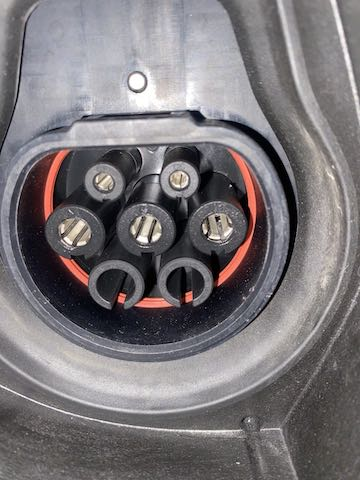
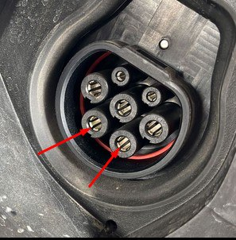

Zeekr из Китая -- это гаджет, поэтому покупка не должна ограничиваться договором
купли продажи (ДКП) и передачей ключей.

Данный раздел должен обозначить важные аспекты/ограничения, связанные с тем,
что авто предназначен для рынка Китая.

## Экраны

### Язык и время

Машины выходят с завода с китайским языком интерфейса. Пока машина еще в Китае,
ее могут скатать в официальный сервис и включить английский язык [^2], но местами
там все равно будут видны иероглифы. Уточняйте этот момент у своего дилера.

С завода установлено время по Пекину - UTC+8, **самостоятельно его изменить не
получится.** Если только у вас прошивка не 4.1.3 и ниже.

**Лечение**: русификация и установка необходимого часового пояса у наших
местных мастеров. Однако после обновления часть русского может отлететь, тогда
процедуру русификации нужно повторять.

### Интернет

В машине установлена китайская eSIM с безлимитным китайским интернетом. Как
только она покидает Китай, она перестает общаться с Zeekr серверами
и пропадает возможность управлять машиной из мобильного приложения (*тут еще
важно наличие FA/MA, но о них ниже*).

**Лечение**: установка местной SIM-карты [^1] у наших местных мастеров

### Сторонние приложения

Производитель не дает возможности устанавливать произвольные Android
приложения. Уточняйте у дилера сможет ли он оставить доступ по ADB открытым,
т.к. это поможет в дальнейшем самостоятельно установить приложения. (_об этом
отдельная статья будет_ - **TODO**)

**Лечение**: открытие инженерного меню и установка приложений [^1] у наших
местных мастеров.

## Ключи

Ключи бывают следующих видов:

1. металлический ключ (запасной)
1. ключ-карта:
     * выглядит как банковская карта
     * нельзя надолго оставлять на беспроводной зарядке
     * для добавления дополнительных ключей требуется МА

1. bluetooth-ключ:
     * квадратная шайба
     * **???** нельзя надолго оставлять на беспроводной зарядке
     * для добавления дополнительных ключей требуется МА

1. мобильный телефон как ключ
     * для добавления требуется FA

---

**Разные модели идут с разными ключами:**

001:

* 1 металлический ключ

* 1 ключ-карта, *(дополнительные платно)*

* 1 bluetooth-ключ *(дополнительные платно)*

009

* 1 ключ-карта, *(дополнительные платно, пока в приложении добавлять ключи нельзя)*

* 1 bluetooth-ключ *(дополнительные платно, пока в приложении добавлять ключи нельзя)*

X

* 1 bluetooth-ключ *(дополнительные пока нельзя ни докупить, ни добавить в
  приложении)*

По замене батареек в Bluetooth ключах [смотреть
тут](FAQ.md#kak-otkryt-bluetooth-klyuch-zamenit-batareyku).

## Аккаунт (MA / FA)

Сначала давайте осознаем как китаец покупает себе Zeekr в Китае:

1. у китайца есть китайский номер (+86xxxxxxxxxxx), который он по китайскому
   законодательству зарегистрировал на свое имя, эта обязательная процедура
   называется **Real name registration или RNR** (*регистрация реального имени*)
1. он регистрируется в [приложении
   Zeekr](https://zeekrlife-h5.zeekrlife.com/pages/download/index) на свой
   китайский номер
1. внутри приложения определяется с машиной и опциями, делает заказ, оплачивает
1. машина, еще будучи на заводе, появляется в приложении владельца -- в
   **Мастер-аккаунте или MA**, который имеет доступ ко всем функциям в приложении
1. т.к. машина имеет свой вшитый номер телефона (в блоке телематики впаяна eSIM
   с безлимитиным инетом в Китае) и он также требует Real name registration
   (RNR), то китаец в приложении Zeekr проходит RNR для машины + записывает
   видео своего лица, шевеля им под китайские инструкции на экране. [^3]

После того, как машина на руках, обладатель может раздать третьим лицам доступ
к машине, они получают так называемый **FA или Family Account** (семейный аккаунт).
Его достаточно для:

* использования телефона как ключа
* удаленного управления климатом (*при наличии рабочей симки в машине! раздача
  машине инета через Wi-Fi не делает ее доступной для управления из приложения*)

Что особенного дает MA? то же, что FA +

* позволяет раздавать FA третьим лицам
* прописывать дополнительные ключи (*в тех моделях, где это возможно, см.
  секцию по ключам*)
* вы сможете удаленно запускать обновление машины (*если сойдутся звезды и вам
  прилетит предложение обновиться*)
* общаться с поддержкой Zeekr как собственник (заявлять об угоне и просить
  удаленно окирпичить?). *Это да и любое потенциальное баловство с удаленным
  управлением пугает владельцев машин, МА которых числятся на китайцах, у
  которых на телефонах висят от единиц до десятков машин.*

---

Рассмотрим варианты приобретения авто по отношению к уровню доступа в
приложении (MA / FA).

### Машина под заказ

Вы выбрали комплектацию, которой нет в наличии и она не в пути, т.е. будет
покупаться в Китае после вашего заказа.

1. устанавливаете переводчик с китайского, который умеет переводить картинки
   (скриншоты экрана). *Например, Yandex Translate*
1. [WeChat + eSender: покупка китайского
   виртуального номера](wechat_n_esender.md)
     * регистрируетесь в WeChat
     * регистрируетесь в eSender
     * на всякий случай включаете в eSender все имеющиеся у вас логин методы
       (email, Apple ID, и т.п.); с WeChat-ом поступаем так же
     * покупаете +86 China Mainland китайский номер в eSender, проходите на
       него Real name registration (без прохождения RNR в eSender приложении на
       купленном номере будет написано "No RNR" и номер могут просто убить).
       После RNR оплачиваете номер, допустим, на год + поставьте напоминание на
       месяцев 11 вперед :)
1. регистрируетесь в [приложении Zeekr](https://zeekrlife-h5.zeekrlife.com/pages/download/index) на
   ваш китайский номер (+86 опускаете и вбиваете 11 цифр), смску получаете в
   приложении eSender
1. если все успешно, то этот номер сообщаете поставщику с просьбой, чтобы на
   него сделали МА
1. ждете машину, она появится в приложении еще будучи на заводе.**На этом этапе
   у вас уже есть МА**
1. [активируете машину / RNR](activate_car.md)

     * проходите RNR для машины (для ее номера)
     * сканируете свое лицо
     * получаете в приложении уведомление об успешной RNR, пункт меню Real name
       registration исчезает из приложения

1. ждете машину :)

### Машина из наличия

Машина выезжает / выехала из Китая и вы хотите заиметь FA/MA.

1. устанавливаете переводчик с китайского, который умеет переводить картинки
   (скриншоты экрана). *Например, Yandex Translate*
1. [WeChat + eSender: покупка китайского
   виртуального номера](wechat_n_esender.md)
     * регистрируетесь в WeChat
     * регистрируетесь в eSender
     * на всякий случай включаете в eSender все имеющиеся у вас логин методы
       (email, Apple ID, и т.п.); с WeChat-ом поступаем так же
     * покупаете +86 China Mainland китайский номер в eSender, проходите на
       него Real name registration (без прохождения RNR в eSender приложении на
       купленном номере будет написано "No RNR" и номер могут просто убить).
       После RNR оплачиваете номер, допустим, на год + поставьте напоминание на
       месяцев 11 вперед :)
1. регистрируетесь в [приложении Zeekr](https://zeekrlife-h5.zeekrlife.com/pages/download/index) на
   ваш китайский номер (+86 опускаете и вбиваете 11 цифр), смску получаете в
   приложении eSender
1. если все успешно, то этот номер сообщаете поставщику с просьбой, чтобы на
   него сделали FA (*может найдете такого, который сможет и MA, но вряд ли*)
1. держатель МА (первый владелец - китаец) пригласит вас попользоваться
   машиной, вы принимаете приглашение и у вас FA -- **ВАЖНО! Для принятия приглашения у машины должен быть интернет! Варианты - машина еще в Китае либо впаяна местная сим. Раздача интернета через Wi-Fi НЕ ПОДОЙДЕТ!**.

Если все еще хотим MA, то далее есть некоторый шанс, что у вас получится
нарваться на людей в поддержке Zeekr, которые на просьбу передать вам MA
запросят список документов на машину (*в этом моменте полагаем, что машина уже
целиком оформлена на вас, номера получены*), вы им передадите доки и через дней
10 вы получите МА (*об этом обычно свидетельствует появление пунктов меню в
приложении, связанных с прошивкой машины / OTA*).

## Зарядка

Крайне рекомендуем ознакомиться с [данным
видео](https://t.me/zeekrclub/1/94294), для понимания процессов зарядки
электроавтомобилей.

Машины оборудованы **только** портами GB/T (китайский разъем). Для любых других
разъемов вам понадобятся переходники.

Зарядки бывают:

* медленные: AC - переменный ток; меньше изнашивают батарею
    * 3.5кВт (16А) - **предел** хорошей бытовой розетки
    * 7 кВт (32А, **только одна фаза**) - предел медленной зарядки для
      китайских Zeekr-ов, выпущенных после февраля 2023

        ??? info "фото однофазного порта"

            { loading=lazy }

    * 11кВт (три фазы, 16А каждая) - все Zeekr 009, а также 001, выпущенные до
      февраля 2023. Если есть 2 доп. контакта как под красными стрелками,
      значит у вас машина может принять 3 фазы.

        ??? info "фото трехфазного порта"

            { loading=lazy }

    !!! info "переходники для медленных зарядок"
        Самым распространенным некитайским стандартом медленной зарядки
        является Type-2. Прежде чем покупать переходники Type2 -> GB/T,
        осмотрите карту зарядок вокруг вашего дома:

        * бывают просто столбики с розеткой, тогда вам нужен кабель с двумя пистолетами
        * бывают столбы с пистолетами, тогда вам нужен переходник мама-мама.

        Сделать это можно с помощью следующих сервисов:

        * РФ: [2Chargers](https://2chargers.net)
        * РБ: [Маланка](https://malankabn.by)

* быстрые: DC - постоянный ток; больше изнашивают батарею
    * 50кВт и выше

    !!! info "адаптеры для быстрых зарядок"
        В РФ и РБ активно развивается сеть быстрых GB/T зарядок, поэтому прежде чем
        покупать дорогостоящие адаптеры CCS2 -> GB/T ($1,700+), осмотрите карту
        зарядок вокруг вашего дома. Сделать это можно с помощью следующих сервисов:

        * РФ: [2Chargers](https://2chargers.net)
        * РБ: [Маланка](https://malankabn.by)

        *Также имейте в виду, что такие адаптеры быстрой зарядки имеют свой мозг и
        свою прошивку внутри, поэтому есть шанс нарваться на старую станцию зарядки, с которой
        ваш новенький переходник может не найти общего языка и зарядка не начнется.*

### Подключение штатной зарядки

Фирменная медленная зарядка Zeekr либо докупается отдельно, либо идет в
комплекте с 001 в комплектациях YOU, ME.

[Машинный перевод инструкции](https://t.me/zeekrclub/129587/173485)

**ВНИМАНИЕ!!!** Подключение должен производить только квалифицированный
электрик! Если вы не уверенны в своих силах и знаниях - не рискуйте! Были
случаи возгорания зарядки и за ней автомобиля из-за неверно подключенной
зарядки.

!!! Danger
    1. Для подключения используется только 230в. Убедитесь, что вам выделено на
       одну фазу не менее 40а. Если меньше - подключать такую зарядку НЕЛЬЗЯ!
       Просите у энергетиков больше мощностей.
    1. Провод 3x6мм медный, только гост, целым куском от автомата ввода в вашем
       щите ведем до зарядки. Никаких удлинителей и соединений. Если расстояние
       больше 30м, используйте медь  3x10мм
    1. Автомат 40а. Назначение - защита от КЗ. Меньше не стоит, будет греться и
       вышибать через какое то время. Исключение - хорошие честные автоматы.
       Можно поставить диф.автомат 40А/30ма. Дорого, зато убережет вас от
       поражения электричеством в случае утечек или повреждения кабеля.
    1. Предусмотрите экстренное выключение зарядки. Автоматом или тупо вилкой с
       розеткой на 32А. Должно быть в легком доступе.
    1. Все провода имеют значение. Нельзя менять местами фазу и ноль или не
       подключать заземление (зарядка не запустится)
    1. Через месяц, а потом через пол года протяните все соединения на
       автоматах/вилках/розетках. Обязательно!

    Обычный грамотный электрик все это знает и легко справится.

    PS: Из важных правил: Не заряжайте мокрую машину! Да, во всех мануалах к
    зарядкам это написано, решать вам, конечно. Но знайте, вода-проводник
    электричества. Если однажды у вас выключится диф автомат на мокрой машине -
    делайте выводы.

    PPS: Обычный автомат защитит только от короткого замыкания и перегруза.

### Оценка времени зарядки

Сделаем следующие предположения:

* батарея не промерзла -- машина не будет тратить время на ее нагрев до рабочих
  температур
* батарею хотим заряжать в пределах диапазона 0-80% -- выше 80% заряд идет
  медленнее

Тогда (пара примеров):

* чтобы "долить" в батарею 50кВт (*от 30% до 80% в 100кВт батарее*), скажем,
  родной зикровской 7кВт зарядкой потребуется `50 / 7 = 7ч 9мин`.

* от качественной бытовой розетки 3.5кВт (16А) за 8 часов машина возьмет `3.5 * 8 = 28кВт`

### 12В АКБ

12В АКБ ответственна за открывание/закрывание машины, музыку, планшет, подключение
тяговой батареи и другие низковольные потребители. Т.о. завести машину с убитой
в ноль 12В АКБ не получится.

Если тяговая батарея (400В) имеет заряд выше 20%, то машина заботится о
подзарядке 12В АКБ, ниже 20% - подзарядки 12В АКБ нет. Поэтому на заглушенной машине
(*не "ready" после нажатия тормоза*) с низким зарядом тяговой батареи вы будете убивать
12В АКБ музыкой, планшетом и прочими низковольтными потребителями, ничего не восполняя.

!!! warning
    В сети [есть информация без уточнения
    модели](https://t.me/zeekrclubrus/72363), Zeekr подзаряжает 12В АКБ только
    когда мультимедиа активна. При долгом простое в глубоком сне машина не
    будет заряжать 12В АКБ.

### Советы

* старайтесь не опускать уровень заряда тяговой батареи ниже 20%
* если разрядили в ноль, постарайтесь как можно скорее поставить на зарядку
  (*долгое хранение в глубоком разряде ведет к неминуемой смерти батареи*)
* если вас это не стесняет и вы можете не заряжать батарею выше 80% без
  необходимости, вы уменьшите ее износ

## Буксировка

Буксировка запрещена производителем и законами физики (*для синхронных
двигателей на постоянных магнитах, а у нас установлены именно они*). [Подробнее
в FAQ](FAQ.md#mozhno-li-buksirovat-)

[^1]:
    разбирается машина, извлекается блок телематики, выпаивается китайская
    eSIM, припаивается слот, куда можно устанавливать физическую симку)

[^2]:
    по состоянию на сентябрь 2023 данная процедура не была доступна для Zeekr X

[^3]:
    говорят, если не пройти эти шаги, то машина даже после перепайки симки
    может не подключаться к инету

