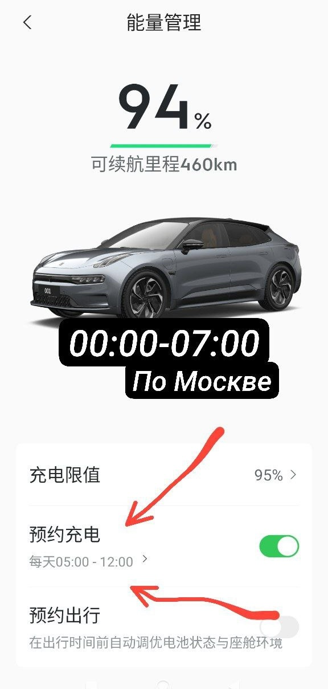
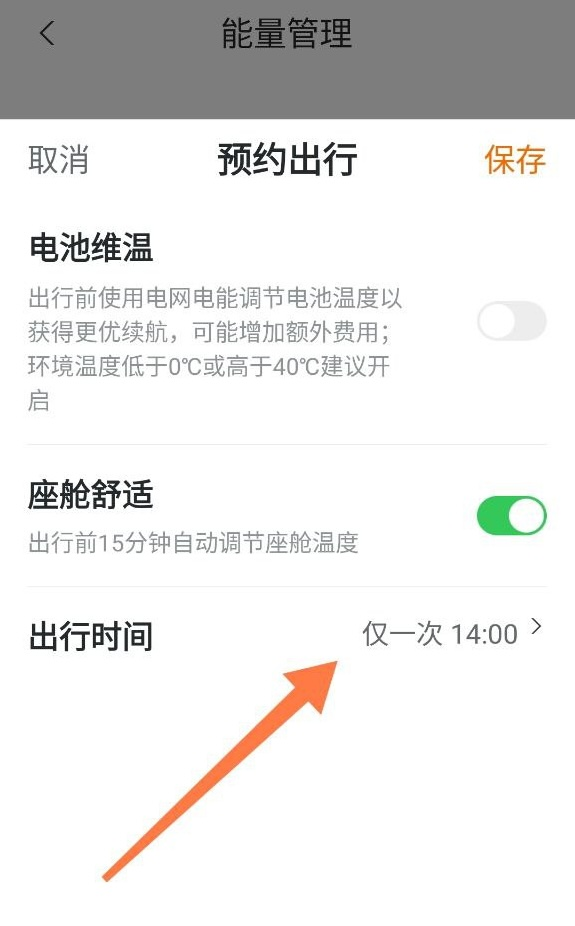

## "Разбудить" машину

При длительном бездействии (кроме зарядки и режимов: комфортная парковка, режим
охраны / sentry), машина засыпает, чтобы экономить 12В АКБ. Чтобы ее разбудить,
нужно позвонить или отправить смс на номер симки, которая установлена в машину.
После того как машина разбужена, можно удаленно управлять ей из приложения.

_Однако встречаются случаи, в которых машина все равно не просыпается. У
некоторых получилось "вылечить" сменой оператора симки
([ссылка](https://t.me/zeekrclub/158198/305450)), у некоторых нет._

## Запланировать зарядку

Независимо от того, какое время на планшете, для того чтобы запланировать
зарядную сессию, используйте **китайское время**.

??? info "screenshot"
    [Видео как найти](https://t.me/zeekrclub/158198/318822)

    { loading=lazy }

## Запланировать прогрев

Используется **текущее время** на планшете. Обогрев включается за 15 минут до
планируемого выезда.

??? info "screenshot"
    Т.е. если в машине установлено время по Москве и надо подогреть салон к 9
    утра, то ставьте 9:00 и в 08:45 включится подогрев салона. Зарядка в это
    время, не обязательно должна быть подключена.

    [Видео как найти](https://t.me/zeekrclub/158198/318822)

    { loading=lazy }
