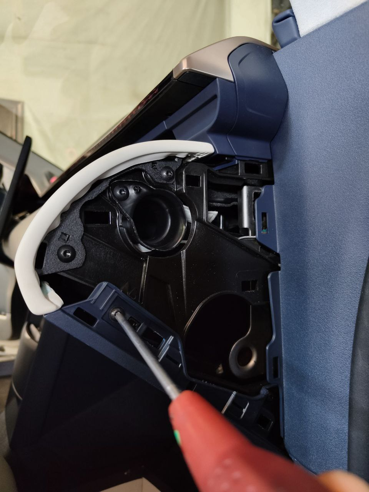
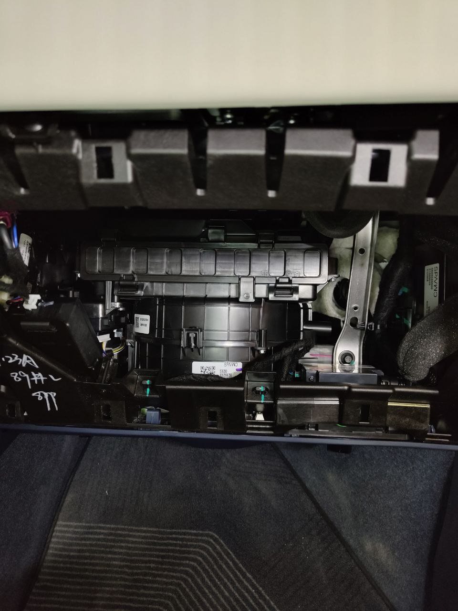

!!! warning
    **При использовании авто в суровых условиях межсервисные интервалы следует
    сократить вдвое.** Такими суровыми условиями считаются следующие (*но ими
    не ограничиваются*):

      * частая езда на короткие дистации
      * езда в пыльных местах
      * во время движения часто тормозите
      * езда по засоленно-щелочным дорогам
      * вождение в горной местности
      * частая езда на низких скоростях
      * вождение в очень холодных или очень жарких условиях

## Тормозная жидкость

Каждые 24 месяца (*12 месяцев в суровых условиях, см. в шапке*).

DOT4.

## Салонный фильтр

Каждые 12 месяцев (*6 месяцев в суровых условиях, см. в шапке*).

??? info "001"
    [Видео замены](https://t.me/zeekrclub/129579/181213)

    Автомобиль июня 2023 не требовал манипуляций петелькой из видео: Открываем
    бардачек, монетой поворачиваем по часовой стрелке фиксаторы внутри бардачка
    по бокам и вытаскиваем их. Всё, бардачок откидывается вниз предоставляя
    доступ к крышке фильтра.

    Веревка нужна чтобы бардачек не сломался когда фиксаторы убираешь. Он
    откидывается до пола и на этой веревке держится.

    Оригинальный фильтр:
    { loading=lazy }
    { loading=lazy }
    { loading=lazy }
    { loading=lazy }
    { loading=lazy }
    { loading=lazy }

??? info "X"
    { loading=lazy }
    { loading=lazy }
    { loading=lazy }
    { loading=lazy }
    { loading=lazy }
    { loading=lazy }
    { loading=lazy }

## Масло в редукторах

Каждые 40,000км (*20,000км в суровых условиях, см. в шапке*).

[Посмотрите свои модели двигателей](FAQ.md#gde-posmotret-nomera-modeli-dvigateley-).

Требуемые объемы масла для редуктора в зависимости от мотора:

* Nidec (Япония) - TZ184XY180: 1.6л - IDEMITSU MOTF TS-1

    * японские моторы, которые устанавливались на старте
    * каталожные номера масла: IDEMITSU: CVTFEX1, IDEMITSU: CVTF-EX1, LIFAN:
      3346041, GEELY: 4060206193.

        ??? info "оригинальное масло - редуктор мотора Nidec"
            Оригинальное масло Lynk & Co то же самое как и у Geely GE13:

            { loading=lazy }

            { loading=lazy }

            { loading=lazy }

* Wei Rui (Китай) - TZ220XSA01: 0.9л - Dexron VI
* Wei Rui (Китай) - TZ220XSA02: ? 0.9л - ? Dexron VI
* Wei Rui (Китай) - TZ180XSB01: ? 0.9л - ? Dexron VI

## Охлаждающая жидкость

Каждые 48 месяцев (*24 месяца в суровых условиях, см. в шапке*).

Оригинальный антифриз: LEC-II -40°C (8891307621) соответствует следующим
требованиям:

* ASTM D3306
* JIS К 2234
* GB 29743
* SAE J1034
* SAE J1941

??? info "фото"

    { loading=lazy }

    { loading=lazy }

**Выбор аналога проще начать с G12+ антифризов и дальше проверять на соответствие
одному из требований выше.**

??? info "001 - объемы систем"

    Охлаждение батареи:

    * CATL: 8.2 ± 0.5L
    * Wei Rui, 86kWh: 8.8 ± 0.5L
    * Wei Rui, 100kWh: 9.3 ± 0.5L

    Охлаждение двигателя (см. тип двигателя [тут](service.md#maslo-v-reduktorah)):

    * Nidec - задний привод: 6.05 ± 0.5L
    * Nidec - полный привод: 6.4 ± 0.5L
    * Wei Rui - задний привод: 6.4 ± 0.5L
    * Wei Rui - полный привод: 7.3 ± 0.5L

## Развал-схождение

| Zeekr 001                                             | Обычная подвеска  | Пневматическая подвеска |
| ----------------------------------------------------- | ----------------- | ----------------------- |
| Front wheel camber angle / развал перед               | -19.4' ± 35'      | -30' ± 35'              |
| Rear wheel camber angle / развал зад                  | -76.7' ± 41'      | -90' ± 41'              |
| Kingpin inclination angle / поперечный наклон шкворня | 7.1° ± 30'        | 7.3° ± 30'              |
| Kingpin caster angle / продольный наклон шкворня      | 5.3° ± 39'        | 5.6° ± 39'              |
| front wheel toe / сход перед                          | 5.2' ± 10'        | 0 ± 10'                 |
| Rear wheel toe / сход зад                             | 5.2' ± 10'        | 0 ± 10'                 |

## Разборка

### Cнятие блоков телематики и мультимедиа

Снятие блока телематики необходимо для перепайки симки, блока мультимедиа для
отправки на русификацию.

[Видео для Zeekr X](https://youtu.be/NZMWxBsn06w?si=Q3AucKN25ORQFN1a).

### Снятие дверных карт

[Видео для Zeekr 001](https://youtu.be/Vq7qfQwOVvg?si=H77TDMJ8ndbtE6h3).
